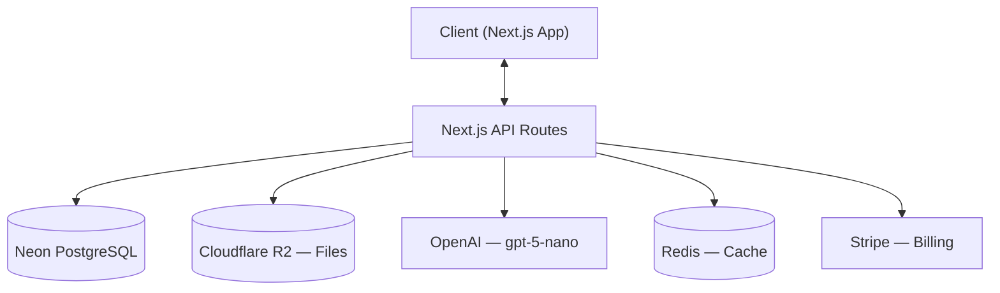
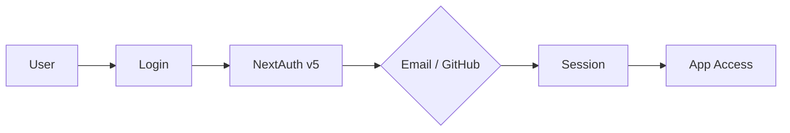
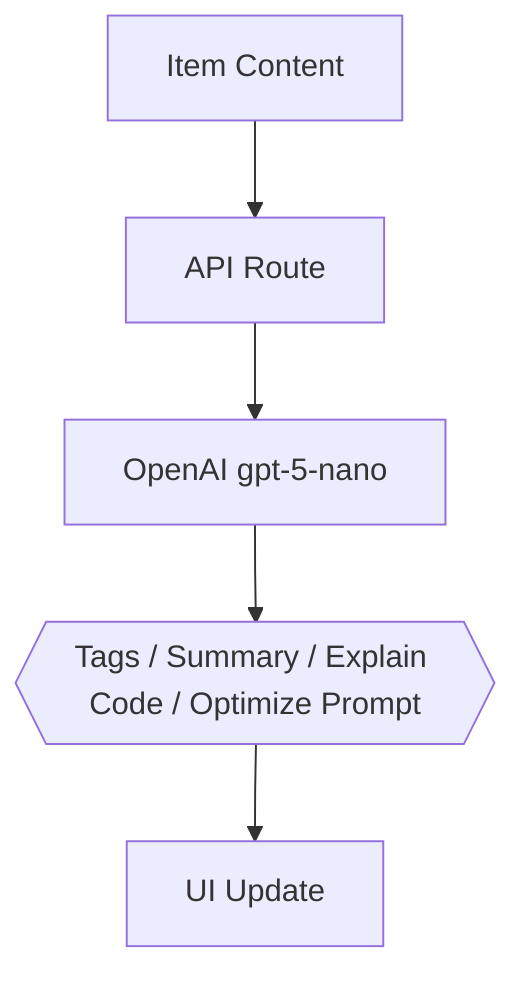

# DevStash — Project Overview

> **Store Smarter. Build Faster.**
> A centralized developer knowledge hub for code snippets, AI prompts, docs, commands, and more.

---

## Problem

Developers keep their essentials scattered across too many places — snippets in VS Code or Notion, AI prompts buried in chat histories, context files lost in project folders, useful links spread across bookmarks, commands hiding in `.txt` files or bash history, and templates stashed in random GitHub gists.

The result: context switching, lost knowledge, and inconsistent workflows.

**DevStash solves this with one searchable, AI-enhanced hub for all developer knowledge and resources.**

---

## Target Users

| Persona                        | Key Needs                                                |
| ------------------------------ | -------------------------------------------------------- |
| **Everyday Developer**         | Quick access to snippets, commands, and links            |
| **AI-First Developer**         | Store and organize prompts, workflows, and context files |
| **Content Creator / Educator** | Save course notes, reusable code examples                |
| **Full-Stack Builder**         | Patterns, boilerplates, API references                   |

---

## Tech Stack

| Layer            | Technology                                                                        |
| ---------------- | --------------------------------------------------------------------------------- |
| **Framework**    | [Next.js](https://nextjs.org/) (React 19, App Router)                             |
| **Language**     | TypeScript                                                                        |
| **Database**     | [Neon PostgreSQL](https://neon.tech/) + [Prisma ORM](https://www.prisma.io/)      |
| **Caching**      | Redis (optional)                                                                  |
| **File Storage** | [Cloudflare R2](https://developers.cloudflare.com/r2/)                            |
| **UI**           | [Tailwind CSS v4](https://tailwindcss.com/) + [shadcn/ui](https://ui.shadcn.com/) |
| **Auth**         | [NextAuth v5](https://authjs.dev/) (Email + GitHub OAuth)                         |
| **AI**           | [OpenAI](https://platform.openai.com/) — `gpt-5-nano`                             |
| **Payments**     | [Stripe](https://stripe.com/) (subscriptions + webhooks)                          |
| **Deployment**   | [Vercel](https://vercel.com/)                                                     |
| **Monitoring**   | [Sentry](https://sentry.io/) (later phase)                                        |

---

## Core Features

### Items & System Types

Every piece of saved knowledge is an **Item**. Each item belongs to one of these built-in types:

| Type        | Description                                   |
| ----------- | --------------------------------------------- |
| **Snippet** | Reusable code blocks with syntax highlighting |
| **Prompt**  | AI prompts and prompt templates               |
| **Note**    | Freeform markdown content                     |
| **Command** | Terminal / CLI commands                       |
| **File**    | Uploaded documents and templates              |
| **Image**   | Screenshots, diagrams, visual references      |
| **URL**     | Bookmarked links and references               |

Pro users can create **custom item types** with their own name, icon, and color.

### Collections

Group items of any type into named collections. Examples: _React Patterns_, _Context Files_, _Python Snippets_.

### Search

Full-text search across content, tags, titles, and types.

### Authentication

- Email + password
- GitHub OAuth
- Managed via NextAuth v5

### Additional Features

- Favorites and pinned items
- Recently used items
- Import from files
- Markdown editor for text-based items
- File uploads (images, docs, templates) via Cloudflare R2
- Export (JSON / ZIP)
- Dark mode (default)

### AI Superpowers (Pro only)

| Feature                 | Description                                            |
| ----------------------- | ------------------------------------------------------ |
| **Auto-tagging**        | Suggest relevant tags based on item content            |
| **AI Summaries**        | Generate concise summaries of notes, snippets, or docs |
| **Explain Code**        | Get plain-language explanations of code snippets       |
| **Prompt Optimization** | Improve and refine AI prompts                          |

Powered by OpenAI `gpt-5-nano`.

---

## Data Model

> Starting schema — will evolve as the project develops.

```prisma
// ─── USER ────────────────────────────────────────────
model User {
  id                   String       @id @default(cuid())
  email                String       @unique
  password             String?
  isPro                Boolean      @default(false)
  stripeCustomerId     String?
  stripeSubscriptionId String?

  items                Item[]
  itemTypes            ItemType[]
  collections          Collection[]
  tags                 Tag[]

  createdAt            DateTime     @default(now())
  updatedAt            DateTime     @updatedAt
}

// ─── ITEM ────────────────────────────────────────────
model Item {
  id           String      @id @default(cuid())
  title        String
  contentType  String      // "text" | "file"
  content      String?     // used for text-based items
  fileUrl      String?
  fileName     String?
  fileSize     Int?
  url          String?
  description  String?
  isFavorite   Boolean     @default(false)
  isPinned     Boolean     @default(false)
  language     String?     // programming language (for syntax highlighting)

  userId       String
  user         User        @relation(fields: [userId], references: [id])

  typeId       String
  type         ItemType    @relation(fields: [typeId], references: [id])

  collectionId String?
  collection   Collection? @relation(fields: [collectionId], references: [id])

  tags         ItemTag[]

  createdAt    DateTime    @default(now())
  updatedAt    DateTime    @updatedAt
}

// ─── ITEM TYPE ───────────────────────────────────────
model ItemType {
  id       String   @id @default(cuid())
  name     String
  icon     String?  // emoji or icon identifier
  color    String?  // hex color for UI badges
  isSystem Boolean  @default(false)

  userId   String?
  user     User?    @relation(fields: [userId], references: [id])

  items    Item[]
}

// ─── COLLECTION ──────────────────────────────────────
model Collection {
  id          String   @id @default(cuid())
  name        String
  description String?
  isFavorite  Boolean  @default(false)

  userId      String
  user        User     @relation(fields: [userId], references: [id])

  items       Item[]

  createdAt   DateTime @default(now())
  updatedAt   DateTime @updatedAt
}

// ─── TAG ─────────────────────────────────────────────
model Tag {
  id     String    @id @default(cuid())
  name   String
  userId String
  user   User      @relation(fields: [userId], references: [id])

  items  ItemTag[]
}

// ─── ITEM ↔ TAG (join table) ─────────────────────────
model ItemTag {
  itemId String
  tagId  String

  item   Item @relation(fields: [itemId], references: [id])
  tag    Tag  @relation(fields: [tagId], references: [id])

  @@id([itemId, tagId])
}
```

---

## Architecture



### Auth Flow



### AI Feature Flow



---

## Monetization

|                   | Free  | Pro             |
| ----------------- | ----- | --------------- |
| **Price**         | $0    | $8/mo or $72/yr |
| **Items**         | 50    | Unlimited       |
| **Collections**   | 3     | Unlimited       |
| **Search**        | Basic | Full-text       |
| **Image uploads** | Yes   | Yes             |
| **File uploads**  | No    | Yes             |
| **Custom types**  | No    | Yes             |
| **AI features**   | No    | Yes             |
| **Export**        | No    | JSON / ZIP      |

Billing handled via Stripe subscriptions with webhook-based sync.

---

## UI / UX Guidelines

- **Dark mode first** — developer-friendly aesthetic
- Minimal, focused interface inspired by Notion, Linear, and Raycast
- Syntax highlighting for all code content
- Collapsible sidebar with filters and collections
- Main workspace in grid or list view
- Full-screen item editor
- Responsive: mobile drawer for sidebar, touch-optimized controls

### Screenshots

- Refer to the screenhsots below for the dashboard UI. It does not have to be exact. Use it as a reference:

- @context/screenshots/dashboard-ui-main.png
- @context/screenshots/dashboard-ui-drawer.png

---

## Development Workflow

- One branch per lesson (for course structure)
- Use AI-assisted development (Cursor, Claude Code, ChatGPT)
- Sentry for runtime monitoring and error tracking
- GitHub Actions for CI (optional)

```bash
# Branch naming convention
git switch -c lesson-01-setup
git switch -c lesson-02-auth
git switch -c lesson-03-items-crud
```

---

## Roadmap

### Phase 1 — MVP

- [ ] Project setup and environment config
- [ ] Authentication (email + GitHub)
- [ ] Items CRUD (all system types)
- [ ] Collections CRUD
- [ ] Basic search
- [ ] Tagging system
- [ ] Free-tier limits enforcement
- [ ] Dark mode UI

### Phase 2 — Pro

- [ ] Stripe integration and billing flow
- [ ] AI features (auto-tag, summarize, explain, optimize)
- [ ] Custom item types
- [ ] File uploads via Cloudflare R2
- [ ] Export (JSON / ZIP)

### Phase 3 — Future

- [ ] Shared collections
- [ ] Team / Org plans
- [ ] VS Code extension
- [ ] Browser extension
- [ ] Public API + CLI tool

---

## Status

**In planning** — ready for environment setup and UI scaffolding.
